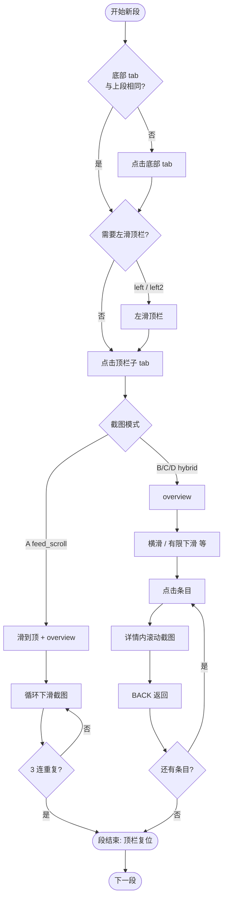
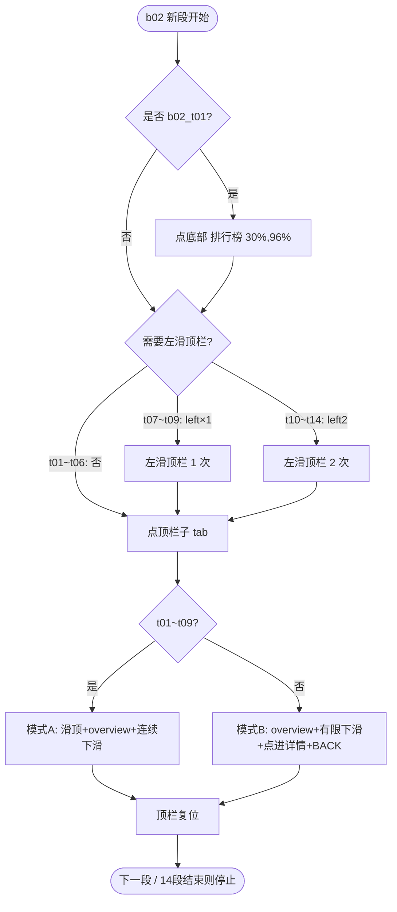

# TapTap 截图导航规划

> 配置文件：`config/taptap_tabs.yaml`（菜单坐标与顺序）  
> 策略配置：`config/taptap_capture_profiles.yaml`（每种 tab 怎么截）  
> 查看完整清单：`python scripts/print_taptap_capture_plan.py`

---

## 一、总体执行顺序（50 段，约 4700+ 张）

**内容多的 3 个大 tab 全量截，消息/我的游戏轻量截：**

```
找游戏(b01) 14 段  ─┐
排行榜(b02) 14 段  ├─ 重点：下滑 / 点进详情 / 横滑
社区(b03)   12 段  ─┘
消息(b04)    4 段  ─┐ 轻量：仅 overview + 最多 8 屏下滑，不点进
我的游戏(b05) 6 段  ─┘
```

每一段（segment）的**固定导航步骤**：

| 步骤 | 动作 | 何时执行 |
|------|------|----------|
| 1 | 点击**底部 tab** | 仅当与上一段底部 tab 不同时（同底部 tab 内只点顶栏） |
| 2 | **左滑顶栏** | 该子 tab 标记了 `top_bar_swipe: left` 或 `left2` |
| 3 | 点击**顶栏子 tab** | 每段必做 |
| 4 | 执行**截图策略**（见下文 A/B/C/D） | 每段必做 |
| 5 | **右滑顶栏复位** | 段结束时，若步骤 2 滑过顶栏则滑回 |

底部 tab 点击位置（从左到右）：

| 顺序 | 底部 tab | 坐标 | 段号 |
|------|----------|------|------|
| 1 | 找游戏 | 10%, 96% | b01_t01 ~ b01_t14 |
| 2 | 排行榜 | 30%, 96% | b02_t01 ~ b02_t14 |
| 3 | 社区 | 50%, 96% | b03_t01 ~ b03_t12 |
| 4 | 消息 | 70%, 96% | b04_t01 ~ b04_t04 |
| 5 | 我的游戏 | 90%, 96% | b05_t01 ~ b05_t06 |

---

## 二、四种截图模式

### 模式 A — 纯纵向滚动（`feed_scroll`）

**适用：** 标准信息流/榜单，内容可一直往下滑。

**流程：**

```
滑到顶部 → 截 overview
→ 循环：下滑一屏 → 截图
→ 连续 3 张几乎相同则提前停止（到底或内容重复）
```

**预计：** 最多 151 张/段（1 overview + 150 次滑动）

---

### 模式 E — 轻量页（`light_tab`）

**适用：** 消息、我的游戏——内容少、基本不能长滚、也不值得点进详情。

**流程：**

```
截 overview → 最多下滑 8 屏（遇 3 连重复提前停）→ 结束
```

**预计：** ~6 张/段

---

### 模式 B — 列表 + 点进详情（`hybrid_*` 通用）

**适用：** 卡片流、帖子、论坛、消息、游戏库等。

**流程：**

```
截 overview
→ 有限下滑（20~45 屏，同样遇 3 连重复可提前停）
→ 对预设坐标依次：
     点击卡片/帖子
     → 截详情 overview
     → 在详情页下滑 N 屏并截图
     → 按返回键 BACK 回到列表
→ 下一个卡片…
```

**子类型：**

| Profile | 下滑上限 | 点进数量 | 典型页面 |
|---------|----------|----------|----------|
| hybrid_card_feed | 40 | 6 张卡片 | Tap制造、云游戏、活动 |
| hybrid_community | 40 | 4 条帖子 | 话题、社区隐藏 tab |
| hybrid_forum | 35 | 5 条帖子 | 论坛 |
| hybrid_messages | 20 | 5 条消息 | 通知/私信/系统 |
| hybrid_my_games | 35 | 4 个游戏 | 心愿单、历史、更新 |
| hybrid_explore | 45 | 3 个条目 | 顶栏滑到最左后的探索 tab |

---

### 模式 C — 今日游戏专用（`hybrid_today`）

**适用：** 今日游戏、新游预告（按日期展示、不可无限滚）。

**流程：**

```
截 overview
→ 横滑日期条（7 个日期，每个截 1 张）
→ 点击「展开/查看更多」→ 短滚 5 屏
→ 点进 6 个游戏卡片（每个：详情截屏 + 滚 + BACK）
```

---

### 模式 D — 游戏分类专用（`hybrid_category`）

**适用：** 找游戏 → 游戏分类。

**流程：**

```
截 overview
→ 横滑分类标签行（4 个标签）
→ 点进 8 个分类格子（每个：详情截屏 + 滚 + BACK）
```

---

## 三、各底部 tab 子菜单一览

### 1. 找游戏（b01）— 14 段

| 段 | 顶栏名称 | 顶栏坐标 | 需左滑顶栏 | 模式 | 说明 |
|----|----------|----------|------------|------|------|
| b01_t01 | 推荐 | 8%, 12% | 否 | **A** | 纯下滑 |
| b01_t02 | 今日游戏 | 22%, 12% | 否 | **C** | 横滑日期 + 点卡片 |
| b01_t03 | Tap 制造 | 36%, 12% | 否 | **B** | 下滑 + 6 卡片详情 |
| b01_t04 | 游戏分类 | 50%, 12% | 否 | **D** | 横滑分类 + 8 格子 |
| b01_t05 | PC游戏 | 65%, 12% | 否 | **A** | 纯下滑 |
| b01_t06 | 安利墙 | 80%, 12% | 否 | **A** | 纯下滑 |
| b01_t07 | 独立游戏 | 72%, 12% | 左滑 1 次 | **B** | 下滑 + 卡片详情 |
| b01_t08 | 新游预告 | 58%, 12% | 左滑 1 次 | **C** | 同今日游戏 |
| b01_t09 | 云游戏 | 44%, 12% | 左滑 1 次 | **B** | 下滑 + 卡片详情 |
| b01_t10 | 活动 | 30%, 12% | 左滑 1 次 | **B** | 下滑 + 卡片详情 |
| b01_t11 | (探索1) | 88%, 12% | 左滑 1 次 | **B** | 探索型 |
| b01_t12 | (探索2) | 75%, 12% | 左滑 2 次 | **B** | 顶栏最左侧区域 |
| b01_t13 | (探索3) | 62%, 12% | 左滑 2 次 | **B** | |
| b01_t14 | (探索4) | 48%, 12% | 左滑 2 次 | **B** | |

> **顶栏规则：** t01~t06 首屏可见；t07~t10 先左滑 1 次再点；t11~t14 先左滑 2 次再点。

---

### 2. 排行榜（b02）— 14 段

| 段 | 顶栏名称 | 模式 | 说明 |
|----|----------|------|------|
| b02_t01 ~ t09 | 热门榜…飙升榜 | **A** | 9 个榜单，纯下滑 |
| b02_t10 ~ t12 | (隐藏榜 1~3) | **B** | 左滑顶栏后，下滑 + 卡片 |
| b02_t13 ~ t14 | (探索) | **B** | 左滑 2 次，探索型 |

---

### 3. 社区（b03）— 12 段

| 段 | 顶栏名称 | 模式 | 说明 |
|----|----------|------|------|
| b03_t01 ~ t03 | 关注/发现/热榜 | **A** | 纯下滑 |
| b03_t04 | 论坛 | **B** | 论坛帖详情 |
| b03_t05 | 视频 | **A** | 纯下滑 |
| b03_t06 ~ t10 | 话题… | **B** | 帖子详情 |
| b03_t11 ~ t12 | (探索) | **B** | 左滑后探索 |

---

### 4. 消息（b04）— 4 段 · 轻量

| 段 | 顶栏名称 | 模式 | 说明 |
|----|----------|------|------|
| b04_t01 ~ t04 | 消息首页/通知/私信/系统 | **E** | 仅 overview + 短滚，不点进 |

> 消息页功能有限，不做 drill_down。

---

### 5. 我的游戏（b05）— 6 段 · 轻量

| 段 | 顶栏名称 | 模式 | 说明 |
|----|----------|------|------|
| b05_t01 ~ t06 | 本机/云玩/预约/心愿单/历史/更新 | **E** | 仅 overview + 短滚，不点进 |

> 去掉原先 12 段里多余的探索占位 tab；个人库内容通常很少。

---

## 四、流程图（单段）



---

## 五、常见出错原因与对策

| 现象 | 原因 | 对策 |
|------|------|------|
| 一直在「找游戏」 | 前 14 段本来就在 b01；或误跑全量而非续跑 | 看日志 `[ADB n/58]`，n≥15 应在排行榜 |
| 顶栏点错 tab | 未先左滑就点了 t07+ | 检查 `top_bar_swipe` 是否执行 |
| 榜单只截几张就停 | 榜单页短、3 连重复提前结束 | 正常；榜单本身不可长滚 |
| 点进详情后没返回 | BACK 失败 | 确保无弹窗遮挡；可加长 `after_back_ms` |
| 排行榜滑着滑到找游戏 | 下滑手势太低碰到底部 tab | 已把滑动区上移到屏幕中部（y 26%–46%），勿改回 58%+ |
| 重复图删不掉崩溃 | PNG 被资源管理器占用 | 勿打开截图目录；已改安全删除 |

---

## 六、修改规划时改哪里

1. **调整顺序 / 增删 tab** → `config/taptap_tabs.yaml`
2. **改纯滚还是点进详情** → 改对应行的 `profile:`
3. **改点进几个卡片、滚几屏** → `config/taptap_capture_profiles.yaml` 里对应 profile 的 `entries` / `scroll_swipes`
4. **改完后预览** → `python scripts/print_taptap_capture_plan.py`

---

## 七、按底部 TAB 分批执行（推荐）

默认**只跑找游戏 14 段**，跑完自动停止；后续再跑排行榜、社区等。

| 命令 | 底部 tab | 段数 |
|------|----------|------|
| `run_taptap_find_games_adb.bat` | 找游戏 b01 | 14 |
| `run_taptap_ranking_adb.bat` | 排行榜 b02 | 14 |
| `run_taptap_community_adb.bat` | 社区 b03 | 12 |
| `run_taptap_scroll_all_adb.bat` | 全部 | 50 |

**合并到同一输出目录**（先找游戏，再排行榜）：

```bat
run_taptap_find_games_adb.bat
run_taptap_ranking_adb.bat -ResumeDir screenshots\taptap_lite\20260620_120000
```

PowerShell 参数：

```powershell
# 默认 b01 找游戏
.\scripts\run_flow.ps1 -App taptap_lite -Flow scroll_all_tabs -AdbCapture

# 指定排行榜
.\scripts\run_flow.ps1 -App taptap_lite -Flow scroll_all_tabs -AdbCapture -BottomTab b02

# 全量
.\scripts\run_flow.ps1 -App taptap_lite -Flow scroll_all_tabs -AdbCapture -BottomTab all
```

`--bottom-tab` 别名：`b01` / `find_games` / `找游戏`，`b02` / `ranking` / `排行榜`，以此类推。

---

## 八、排行榜（b02）专篇 — 点击顺序与截图流程

> 找游戏跑完后，在同一目录追加排行榜：
> `.\run_taptap_ranking_adb.bat -ResumeDir screenshots\taptap_lite\20260620_111750`

### 8.1 进入排行榜

| 步骤 | 操作 | 坐标 / 说明 |
|------|------|-------------|
| 1 | 点击底部 **「排行榜」** | `30%, 96%` |
| 2 | 等待顶栏加载 | 首屏可见：热门榜 ~ 口碑榜 |

之后 **14 段子 tab 按顺序跑**，同底部 tab 内**不再重复点底部**，只在顶栏切换。

### 8.2 顶栏点击顺序（14 段）

#### 第一组：首屏可见（无需左滑顶栏）— 模式 A' 榜单下滑

| 顺序 | 段 key | 顶栏 | 点击坐标 | 截图流程 |
|------|--------|------|----------|----------|
| 1 | b02_t01 | 热门榜 | 8%, 12% | 滑到顶 → overview → 连续下滑至「暂无更多」 |
| 2 | b02_t02 | 预约榜 | 22%, 12% | 同上 |
| 3 | b02_t03 | 热玩榜 | 36%, 12% | 同上 |
| 4 | b02_t04 | 新品榜 | 50%, 12% | 同上 |
| 5 | b02_t05 | 热卖榜 | 65%, 12% | 同上 |
| 6 | b02_t06 | 口碑榜 | 80%, 12% | 同上 |

#### 第二组：左滑顶栏 1 次 — 模式 A' 榜单下滑

| 顺序 | 段 key | 顶栏 | 点击坐标 | 截图流程 |
|------|--------|------|----------|----------|
| 7 | b02_t07 | 下载榜 | 72%, 12% | **左滑顶栏** → 点 tab → 下滑至底 |
| 8 | b02_t08 | 更新榜 | 58%, 12% | 同上 |
| 9 | b02_t09 | 飙升榜 | 88%, 12% | 同上 |

#### 第三组：左滑顶栏 2 次 — 模式 B 下滑 + 点游戏详情

| 顺序 | 段 key | 顶栏 | 点击坐标 | 截图流程 |
|------|--------|------|----------|----------|
| 10 | b02_t10 | (隐藏榜1) | 75%, 12% | overview → 下滑≤40 → **点 6 个游戏** → 详情内滚 → BACK |
| 11 | b02_t11 | (隐藏榜2) | 62%, 12% | 同上 |
| 12 | b02_t12 | (隐藏榜3) | 48%, 12% | 同上 |

#### 第四组：左滑顶栏 2 次 — 模式 B 探索型

| 顺序 | 段 key | 顶栏 | 点击坐标 | 截图流程 |
|------|--------|------|----------|----------|
| 13 | b02_t13 | (探索1) | 35%, 12% | overview → 下滑≤45 → **点 3 个条目** → BACK |
| 14 | b02_t14 | (探索2) | 22%, 12% | 同上 |

每段结束若曾左滑顶栏 → **右滑复位**（脚本自动）。

### 8.3 两种截图模式详解

**模式 A'' — 榜单 + 游戏详情深截（t01~t09，`ranking_list_detail`）**

```
点顶栏子 tab
  → 截榜单 overview（第 1 名附近）
  → 下滑截完整个榜（至 top150 / 暂无更多，最多 40 屏）
  → 滑回榜单顶部
  → 点进榜内 3 个游戏（第 1、4、7 名左右位置）
       每个游戏：
         默认在「详情」→ overview + 下滑至内容重复
         → 点「统计」→ overview + 下滑
         → 点「新版本」→ overview + 下滑
         → 点「评价」→ overview + 下滑
         → 点「攻略」→ overview + 下滑
         → 点「论坛」→ overview + 下滑
         → BACK 回榜单
```

每个子 tab 内 **连续 5 帧相似即停**（刷不出新内容就停）。

**预计：** 每榜 ~40 张列表 + 3 游戏 × ~80 张详情 ≈ **~220 张/榜**，9 榜 ≈ **~2000 张**。

---

**模式 A' — 仅榜单列表（`ranking_scroll`，备用）**

```
点顶栏子 tab
  → 滑到顶部（第 1 名）
  → 截 overview
  → 循环：下滑一屏 → 截图
  → 直到「暂无更多」或连续 15 帧高度相似（榜单行样式接近，放宽判定）
```

**实测：** 每个榜约 **top 150**（一屏 ~8 条，需约 **20~25 次下滑**），每榜预计 **~25–40 张**。

> 之前只截几张就停，是因为列表行样式相似触发了过严的重复检测；已改用 `ranking_scroll`（40 屏上限、duplicate 0.98）。

**模式 B — 卡片/探索页（t10~t14）**

```
点顶栏子 tab
  → 截 overview
  → 有限下滑（最多 40~45 屏）
  → 依次点击预设位置的游戏/条目：
       点击 → 等 450ms → 截详情 overview
       → 详情内下滑 4~5 屏并截图
       → 按 BACK 返回列表
  → 下一个条目…
```

t10~t12 点 **6 个**游戏；t13~t14 点 **3 个**条目。

### 8.4 流程图（单段）



### 8.5 预计与执行

| 项目 | 数值 |
|------|------|
| 段数 | 14 |
| 九个榜单 (t01~t09) | 9 × ~220 ≈ **2000 张**（含游戏详情深截） |
| 隐藏/探索 (t10~t14) | ~250 张 |
| **合计预期** | **~2200–2300 张** |
| 耗时 | 约 1–2 小时 |

**执行命令：**

```powershell
cd D:\code\zqh\PageSnapFlow
.\run_taptap_ranking_adb.bat -ResumeDir screenshots\taptap_lite\20260620_111750
```

跑前：模拟器唤醒、TapTap 在前台（任意页即可，脚本会点进排行榜）。跑时日志应显示 `[ADB 1/14] b02_t01` … `[ADB 14/14] b02_t14`，底部 tab 高亮 **排行榜**。
